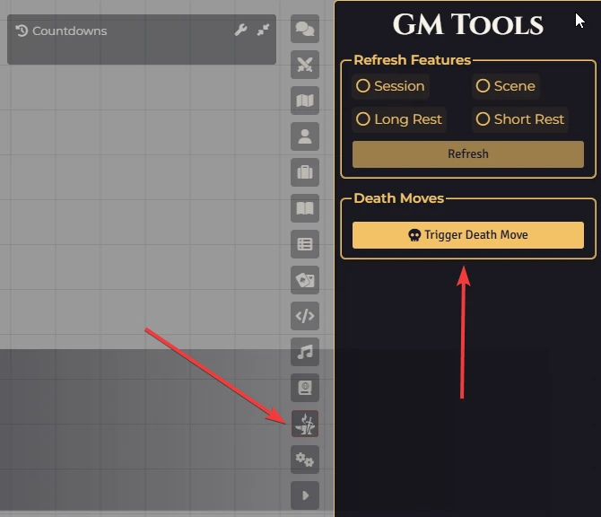
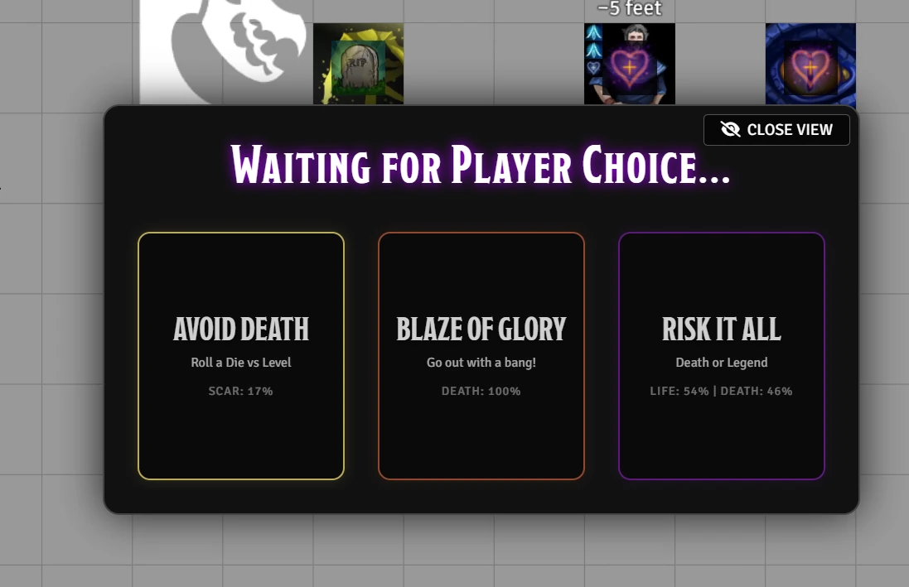

# 🗡️ Daggerheart: Death Moves

**Daggerheart: Death Moves** is a Foundry VTT module designed to elevate the tension and immersion of the "Death Move" moment in the game. Instead of a simple manual procedure, this module presents the player with the three canonical choices in a dramatic, audiovisual interface.

You need to enable sound to play the video.
<video src="https://github.com/user-attachments/assets/42b54d53-d3f7-43bf-9307-906797cb1000" 
       controls 
       width="720"
       autoplay 
       loop 
       muted></video>
       
---

## 🌟 Features

* **Cinematic Selection Screen:** When triggered, the player is presented with a full-screen overlay featuring three distinct options: **Avoid Death**, **Blaze of Glory**, and **Risk it All**.
* **Audiovisual Immersion:** The module brings death moves to life by automatically playing specific images, animations, and sounds for every outcome, ensuring a dramatic experience.
* **3D Dice Integration:** Seamlessly integrates with **Dice So Nice!** to display rolls directly on the screen.
* **Rule Assistance:** Automatically posts the correct rule interpretation in the chat based on the roll result.
* **Configurable Countdown:** Customize the duration of the suspenseful countdown, or disable it completely for instant results.

### The Options
* **Avoid Death:** Features a suspenseful countdown (configurable) and an automatic check against the linked character's Level, displaying unique visual results for Safe or Scar outcomes.
* **Blaze of Glory:** Triggers a dramatic sound effect, a configurable chat message, and displays a splash art, allowing the player to narrate their final heroic moment.
* **Risk it All:** The classic experience with a countdown (configurable), dice rolling, and cinematic results for Hope, Fear, or Critical Success.

---

## 🛠️ Usage

There are two ways for the Gamemaster to trigger the Death Moves screen for a player:

### Option 1: Sidebar Button
1.  Open the **Daggerheart Menu** (the system's sidebar).
2.  Locate the **Death Moves** section.
3.  Click the **Trigger Death Move** button (skull icon).
4.  Select the dying player from the dialog list.

<p align="center">
  
</p>

### Option 2: Macro
1.  Create a macro with the following command:
    ```javascript
    DeathMoves.trigger();
    ```
2.  Run the macro and select the dying player from the list.

### After Triggering

* **Choose Your Fate:** The player receives the Death Moves screen. Once they click a button, the sequence begins.

<p align="center">
  
</p>

---

## ⚙️ Configuration

You can customize the entire experience in **Configure Settings > Module Settings > Daggerheart: Death Moves**. This allows you to replace all background images, result screens, and sound effects. You can also adjust the countdown duration from 0 to 10 seconds and customize the Blaze of Glory chat message.

---

## 🚀 Manual Installation

Go to **modules**, click **Install Module**, and paste the link:
 
`https://raw.githubusercontent.com/brunocalado/daggerheart-death-moves/main/module.json`

---

## 📜 Changelog

You can read the full history of changes in the [CHANGELOG](CHANGELOG.md).

---

## ⚖️ Credits and License

* **Code License:** Available at [LICENSE](LICENSE).
* **Assets:** The audio and images provided are AI-generated and are under the [CC0 1.0 Universal Public Domain Dedication](https://creativecommons.org/publicdomain/zero/1.0/).

**Disclaimer:** This module is an independent creation and is not affiliated with Darrington Press.