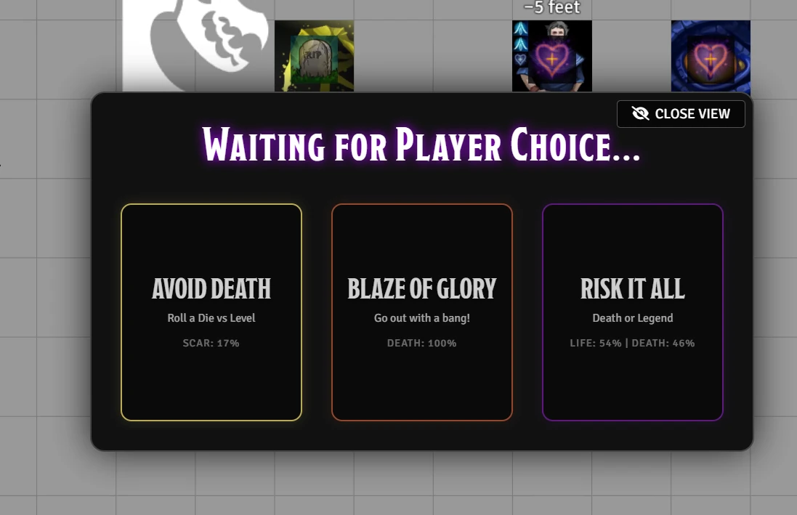

# ☠️ Daggerheart: Death Moves

**Daggerheart: Death Moves** is a Foundry VTT module that enhances the "Death Move" moment with a dramatic interface and full automation support for choosing between **Avoid Death**, **Blaze of Glory**, or **Risk it All**.

  

---

## 🌟 Key Features

### 🎭 Dramatic Interface
* **Selection Screen:** The dying player faces a compact interface to choose their fate: **Avoid Death**, **Blaze of Glory**, or **Risk it All**.
* **Spectator Mode:** While the active player decides, all other players (and the GM) see a synchronized "Waiting..." screen, keeping the entire party focused on the moment.
* **Dramatic Announcements:** Once a choice is made, a text banner appears for everyone, announcing the decision before the results are revealed.
* **Probability Display:** Each option shows the calculated probability of outcomes based on the character's level.

### 🎲 Mechanics & Automation
* **Sequential Risk Rolls:** "Risk it All" builds maximum tension by rolling the **Fear** die first, pausing for effect, and then rolling the **Hope** die — with colored border effects for each phase.
* **Stylized Chat Cards:** Results are posted to the chat as gold-framed cards with easy-to-read text.
* **Full Automation (Core):** Automatically applies Scars on failed Avoid Death rolls, distributes HP/Stress on Hope results, and clears all on Critical Success.
* **Homebrew Automation:** Supports alternate scar rules — lets the player pick from six scar types (Evasion, Hit Point, Hope, Negative Experience, Stress, Thresholds) with Active Effects applied automatically.
* **HP Trigger:** Optionally detects when a character's HP reaches maximum and triggers the Death Move automatically (or opens a GM confirmation dialog).
* **Phoenix Feather Support:** Recognizes a configurable item that grants +1 bonus to Avoid Death rolls.
* **Queue System:** Multiple simultaneous death triggers are queued and processed one at a time.

---

## 🛠️ How to Use

### 1. The GM Triggers the Move
The Gamemaster initiates the scene when a character falls:
* **Sidebar:** Open the Daggerheart Menu (sidebar) and click the **"Trigger Death Move"** button (skull icon). Select the player from the list.
* **Macro:** Execute `DeathMoves.trigger()` via a script macro. You can use `DeathMoves.trigger("User Name")`.

  

### 2. The Player Chooses
The target player receives the interactive screen.
* **Avoid Death:** Automatically rolls 1d12 against the character's Level.
* **Risk it All:** Initiates the sequential Fear → Hope roll with border effects.
* **Blaze of Glory:** Posts a dramatic farewell message to chat.

### 3. The Table Watches
Everyone else is in **Spectator Mode**. They cannot interact, but they see the announcement banner in sync with the active player.

---

## ⚙️ Configuration

Customize the experience in **Configure Settings > Daggerheart: Death Moves**:

* **Automation Mode:** Choose between **None**, **Core** (auto-apply scars and HP/Stress), or **Homebrew** (alternate scar picker).
* **Max HP Trigger:** Set to **None**, **Open GM Dialog**, or **Trigger Automatically** when HP reaches maximum.
* **Phoenix Item Name:** Name of the item that grants +1 bonus to Avoid Death rolls.
* **Blaze of Glory Message:** Customize the farewell message posted to chat.
* **Show Probabilities:** Toggle probability percentages on the selection buttons.

---

## 🚀 Installation

Install via the Foundry VTT Module browser or use this manifest link:
`https://raw.githubusercontent.com/brunocalado/daggerheart-death-moves/main/module.json`

---

## ⚖️ Credits and License

* **Code License:** GPL-3.0.

**Disclaimer:** This module is an independent creation and is not affiliated with Darrington Press.

# 🧰 My Daggerheart Modules

| Module | Description |
| :--- | :--- |
| 💀 [**Adversary Manager**](https://github.com/brunocalado/daggerheart-advmanager) | Scale adversaries instantly and build balanced encounters in Foundry VTT. |
| 💥 [**Critical**](https://github.com/brunocalado/daggerheart-critical) | Animated Critical. |
| 💠 [**Custom Stat Tracker**](https://github.com/brunocalado/dh-new-stat-tracker) | Add custom trackers to actors. |
| ☠️ [**Death Moves**](https://github.com/brunocalado/daggerheart-death-moves) | Enhances the Death Move moment with a dramatic interface and full automation. |
| 📏 [**Distances**](https://github.com/brunocalado/daggerheart-distances) | Visualizes combat ranges with customizable rings and hover calculations. |
| 📦 [**Extra Content**](https://github.com/brunocalado/daggerheart-extra-content) | Homebrew for Daggerheart. |
| 🤖 [**Fear Macros**](https://github.com/brunocalado/daggerheart-fear-macros) | Automatically executes macros when the Fear resource is changed. |
| 😱 [**Fear Tracker**](https://github.com/brunocalado/daggerheart-fear-tracker) | Adds an animated slider bar with configurable fear tokens to the UI. |
| 🎁 [**Mystery Box**](https://github.com/brunocalado/dh-mystery-box) | Introduces mystery box mechanics for random loot and surprises. |
| ⚡ [**Quick Actions**](https://github.com/brunocalado/daggerheart-quickactions) | Quick access to common mechanics like Falling Damage, Downtime, etc. |
| 📜 [**Quick Rules**](https://github.com/brunocalado/daggerheart-quickrules) | Fast and accessible reference guide for the core rules. |
| 🎲 [**Stats**](https://github.com/brunocalado/daggerheart-stats) | Tracks dice rolls from GM and Players. |
| 🧠 [**Stats Toolbox**](https://github.com/brunocalado/dh-statblock-importer) | Import using a statblock. |
| 🛒 [**Store**](https://github.com/brunocalado/daggerheart-store) | A dynamic, interactive, and fully configurable store for Foundry VTT. |

# 🗺️ Adventures

| Adventure | Description |
| :--- | :--- |
| ✨ [**I Wish**](https://github.com/brunocalado/i-wish-daggerheart-adventure) | A wealthy merchant is cursed; one final expedition may be the only hope. |
| 💣 [**Suicide Squad**](https://github.com/brunocalado/suicide-squad-daggerheart-adventure) | Criminals forced to serve a ruthless master in a land on the brink of war. |
