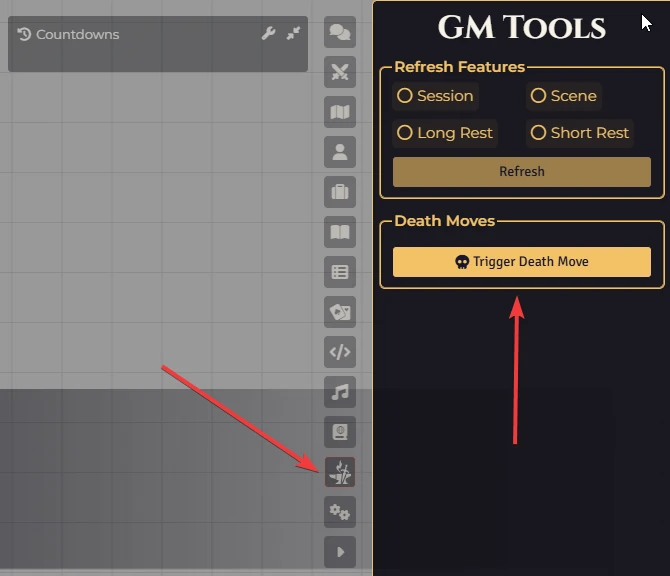

# ☠️ Daggerheart: Death Moves

**Daggerheart: Death Moves** is a Foundry VTT module designed to transform the "Death Move" moment into a high-stakes, cinematic event. Instead of a simple manual roll, this module orchestrates a dramatic audiovisual experience for the whole table.

You need to enable sound to play the video.
<video src="https://github.com/user-attachments/assets/37cafad1-4a04-4367-bee7-754d2198a257" 
       controls 
       width="720"
       autoplay 
       loop 
       muted></video>
---

## 🌟 Key Features

### 🎭 Cinematic Experience
* **Selection Screen:** The dying player faces a dramatic, full-screen interface to choose their fate: **Avoid Death**, **Blaze of Glory**, or **Risk it All**.
* **Spectator Mode:** While the active player decides, all other players (and the GM) see a synchronized "Waiting..." screen, keeping the entire party focused on the moment.
* **Dramatic Announcements:** Once a choice is made, a massive text banner appears for everyone, announcing the decision before the results are revealed.

### 🎲 Mechanics & Immersion
* **Sequential Risk Rolls:** The "Risk it All" mechanic builds maximum tension by rolling the **Fear** die first, pausing for effect, and then rolling the **Hope** die.
* **Stylized Chat Cards:** Results are posted to the chat as beautiful, gold-framed cards with dynamic background images and easy-to-read text.
* **Audiovisual Suite:** Includes distinct sounds for the countdown, button selections, and final outcomes (Hope, Fear, Scars, etc.).

### 🌍 Localization
* **Multi-Language Audio:** Native support for **English** and **Portuguese (Brazil)** audio lines. You can switch the voice language instantly in the settings.

---

## 🛠️ How to Use

### 1. The GM Triggers the Move
The Gamemaster initiates the scene when a character falls:
* **Sidebar:** Open the Daggerheart Menu (sidebar) and click the **"Trigger Death Move"** button (skull icon). Select the player from the list.
* **Macro:** Execute `DeathMoves.trigger()` via a script macro. You can use `DeathMoves.trigger("User Name")`.

  

### 2. The Player Chooses
The target player receives the interactive screen. A suspenseful countdown (configurable) adds pressure.
* **Avoid Death:** Automatically rolls 1d12 against the character's Level.
* **Risk it All:** Initiates the sequential Hope vs. Fear roll.
* **Blaze of Glory:** Triggers a heroic finale message and sound.

  

### 3. The Table Watches
Everyone else is in **Spectator Mode**. They cannot interact, but they see the announcement banner and hear the sounds in sync with the active player.

---

## ⚙️ Configuration

Customize the experience in **Configure Settings > Daggerheart: Death Moves**:

* **Sound Language:** Choose between **English**, **Português (Brasil)**, or **Custom** (to use your own file paths).
* **Countdown:** Adjust the duration in seconds (or set to 0 for instant choices).
* **Images & Sounds:** Replace any asset—backgrounds, result splash art, or sound effects—to match your campaign's tone.
* **Sequential Roll:** Toggle the dramatic delay for "Risk it All".

---

## 🚀 Installation

Install via the Foundry VTT Module browser or use this manifest link:
`https://raw.githubusercontent.com/brunocalado/daggerheart-death-moves/main/module.json`

---

## ⚖️ Credits and License

* **Code License:** MIT License.
* **Assets:** Audio and images provided are [CC0 1.0 Universal Public Domain](https://creativecommons.org/publicdomain/zero/1.0/).

**Disclaimer:** This module is an independent creation and is not affiliated with Darrington Press.

# 🧰 My Daggerheart Modules

| Module | Description |
| :--- | :--- |
| 💀 [**Adversary Manager**](https://github.com/brunocalado/daggerheart-advmanager) | Scale adversaries instantly and build balanced encounters in Foundry VTT. |
| ☠️ [**Death Moves**](https://github.com/brunocalado/daggerheart-death-moves) | Enhances the Death Move moment with immersive audio and visual effects. |
| 📏 [**Distances**](https://github.com/brunocalado/daggerheart-distances) | Visualizes combat ranges with customizable rings and hover calculations. |
| 🤖 [**Fear Macros**](https://github.com/brunocalado/daggerheart-fear-macros) | Automatically executes macros when the Fear resource is changed. |
| 😱 [**Fear Tracker**](https://github.com/brunocalado/daggerheart-fear-tracker) | Adds an animated slider bar with configurable fear tokens to the UI. |
| 🎲 [**Stats**](https://github.com/brunocalado/daggerheart-stats) | Tracks dice rolls from GM and Players. |
| 🧠 [**Stats Toolbox**](https://github.com/brunocalado/dh-statblock-importer) | Import using a statblock. |
| 🛒 [**Store**](https://github.com/brunocalado/daggerheart-store) | A dynamic, interactive, and fully configurable store for Foundry VTT. |
| 📦 [**Extra Content**](https://github.com/brunocalado/daggerheart-extra-content) | Homebrew for Daggerheart. |
| ⚡ [**Quick Actions**](https://github.com/brunocalado/daggerheart-quickactions) | Quick access to common mechanics like Falling Damage, Downtime, etc. |
| 📜 [**Quick Rules**](https://github.com/brunocalado/daggerheart-quickrules) | Fast and accessible reference guide for the core rules. |

# 🗺️ Adventures

| Adventure | Description |
| :--- | :--- |
| ✨ [**I Wish**](https://github.com/brunocalado/i-wish-daggerheart-adventure) | A wealthy merchant is cursed; one final expedition may be the only hope. |
| 💣 [**Suicide Squad**](https://github.com/brunocalado/suicide-squad-daggerheart-adventure) | Criminals forced to serve a ruthless master in a land on the brink of war. |