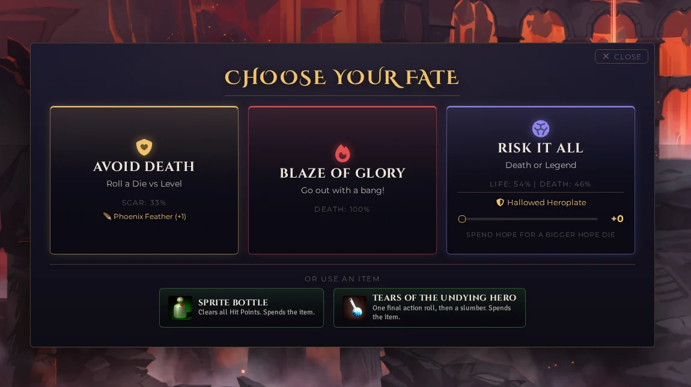
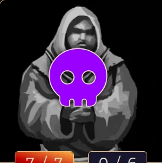
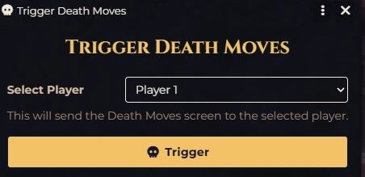
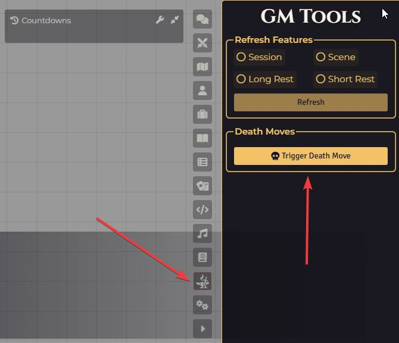
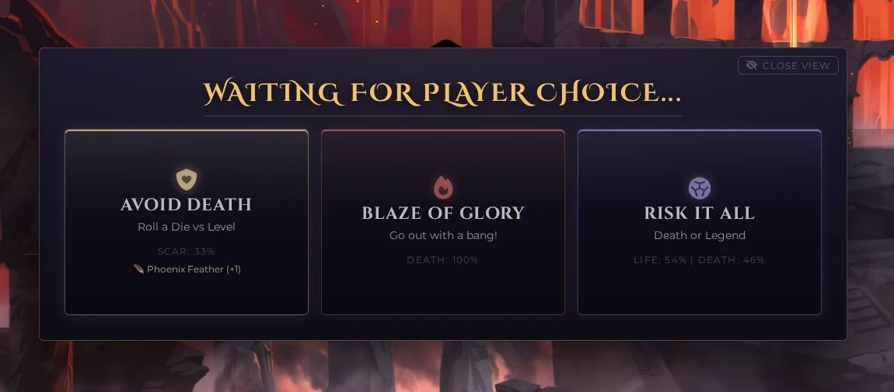
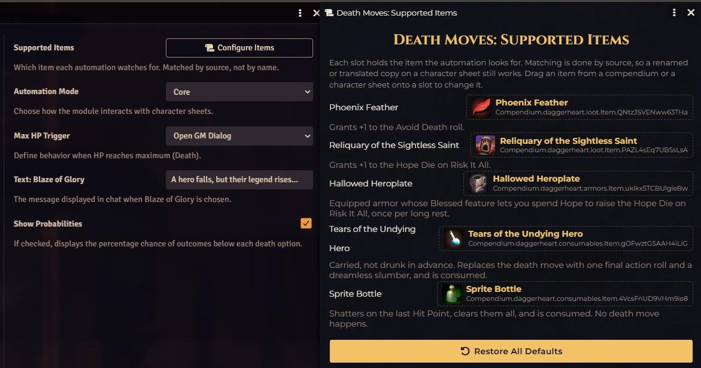

# ☠️ Daggerheart: Death Moves

**Daggerheart: Death Moves** is a Foundry VTT module that enhances the "Death Move" moment with a dramatic interface and full automation support for choosing between **Avoid Death**, **Blaze of Glory**, or **Risk it All**.

<p align="center">
  
</p>


[](https://buymeacoffee.com/mestredigital) [](https://mestredigital.online/pages/projetos-en)

---

## 🌟 Key Features

### 🎭 Dramatic Interface
* **Sheet Skull:** The skull the character sheet puts over the portrait once every Hit Point is marked sends this module's screen instead of the system's own Death Move dialog, and is painted purple to say so. The GM can press it, and so can the player the character belongs to.
* **Selection Screen:** The dying player faces a compact interface to choose their fate: **Avoid Death**, **Blaze of Glory**, or **Risk it All**.
* **Spectator Mode:** While the active player decides, all other players (and the GM) see a synchronized "Waiting..." screen, keeping the entire party focused on the moment.
* **Dramatic Announcements:** Once a choice is made, a text banner appears for everyone, announcing the decision before the results are revealed.
* **Probability Display:** Each option shows the calculated probability of outcomes, based on the character's level and on any supported item they are carrying.

### 🎲 Mechanics & Automation
* **Sequential Risk Rolls:** "Risk it All" builds maximum tension by rolling the **Fear** die first, pausing for effect, and then rolling the **Hope** die — with colored border effects for each phase.
* **Stylized Chat Cards:** Results are posted to the chat as gold-framed cards with easy-to-read text.
* **Full Automation (Core):** Automatically applies Scars on failed Avoid Death rolls, distributes HP/Stress on Hope results, and clears all on Critical Success.
* **Homebrew Automation:** Supports alternate scar rules — lets the player pick from six scar types (Evasion, Hit Point, Hope, Negative Experience, Stress, Thresholds) with Active Effects applied automatically.
* **HP Trigger:** Optionally detects when a character's HP reaches maximum and triggers the Death Move automatically (or opens a GM confirmation dialog).
* **Phoenix Feather Support:** Recognizes a configurable item that grants +1 bonus to Avoid Death rolls.
* **Reliquary of the Sightless Saint Support:** Recognizes a configurable item that grants +1 bonus to the Hope Die on Risk It All.
* **Hallowed Heroplate Support:** A Hope slider appears inside the Risk It All button, raising the Hope Die by the amount spent. The armor has to be equipped, since an unworn armor grants none of its features. The once-per-long-rest limit uses the armor's own Blessed counter, so a Daggerheart long rest refreshes it. When the slider does not apply, the armor says why.
* **Tears of the Undying Hero Support:** A button for the potion appears on the death move screen. One click skips the death move: the potion is consumed, the character takes one final action roll, and is left unconscious until an ally uses Tend to Wounds.
* **Sprite Bottle Support:** A button for the bottle appears on the death move screen. One click skips the death move: Hit Points are cleared, the bottle is consumed, and a chat card explains what happened.
* **Queue System:** Multiple simultaneous death triggers are queued and processed one at a time.

---

## 🛠️ How to Use

### 1. Starting a Death Move
There are four ways in, and all of them lead to the same screen:
* **Character Sheet:** Press the purple skull over the portrait. It appears once every Hit Point is marked. A player pressing it asks the GM's client to run the scene, since that is where the queue and the chat cards live — so a GM has to be connected. A death move acts on the character assigned to the player, so the sheet has to be that character.
* **Sidebar:** Open the Daggerheart Menu (sidebar) and click the **"Trigger Death Move"** button (skull icon). Select the player from the list.
* **Macro:** Execute `DeathMoves.trigger()` via a script macro. You can use `DeathMoves.trigger("User Name")`.
* **Automatically:** With **Max HP Trigger** configured, reaching maximum Hit Points starts the move on its own, or opens a confirmation dialog for the GM first.

<p align="center">
  
  &nbsp;&nbsp;
  
</p>

<p align="center">
  
</p>

### 2. The Player Chooses
The target player receives the interactive screen.
* **Avoid Death:** Automatically rolls 1d12 against the character's Level, plus 1 with a Phoenix Feather.
* **Risk it All:** Initiates the sequential Fear → Hope roll with border effects. With a Hallowed Heroplate equipped, a Hope slider sits inside the button.
* **Blaze of Glory:** Posts a dramatic farewell message to chat.

Any carried item that can replace the death move gets its own button below the three options, and one click uses it. Nothing is ever spent unless the player clicks it, so ignoring the buttons simply leads to the normal choice above.

### 3. The Table Watches
Everyone else is in **Spectator Mode**. They cannot interact, but they see the announcement banner in sync with the active player.

<p align="center">
  
</p>

---

## ⚙️ Configuration

Customize the experience in **Configure Settings > Daggerheart: Death Moves**:

<p align="center">
  
</p>

* **Automation Mode:** Choose between **None**, **Core** (auto-apply scars and HP/Stress), or **Homebrew** (alternate scar picker).
* **Max HP Trigger:** Set to **None**, **Open GM Dialog**, or **Trigger Automatically** when HP reaches maximum.
* **Supported Items:** Opens a window with one slot per automated item. Drag an item from a compendium or a character sheet onto a slot to change what the automation looks for. Matching is by source, not by name, so a renamed or translated copy still works. An item only carries a source if it reached the sheet from a compendium, directly or by way of the world Items directory. Homebrew created from scratch in the world Items directory carries none, so put it in a world compendium first and drag it from there.
* **Blaze of Glory Message:** Customize the farewell message posted to chat.
* **Show Probabilities:** Toggle probability percentages on the selection buttons.

---

## 🚀 Installation

Install via the Foundry VTT Module browser or use this manifest link:

```
https://raw.githubusercontent.com/brunocalado/daggerheart-death-moves/main/module.json
```

---

## ⚖️ Credits and License

* **Code License:** GPL-3.0.

**Disclaimer:** This module is an independent creation and is not affiliated with Darrington Press.

* **Artwork:** `thumbnail.webp` — [photo by Sebastian Arie Voortman](https://www.pexels.com/photo/woman-wearing-a-scary-costume-with-horns-18424789/), used under the [Pexels License](https://www.pexels.com/license/).

# 🧰 My Daggerheart Modules

| Module | Description |
| :--- | :--- |
| 💀 [**Adversary Manager**](https://github.com/brunocalado/daggerheart-advmanager) | Scale adversaries instantly and build balanced encounters. |
| 🖼️ [**Art Mapper**](https://github.com/brunocalado/dh-assets) | Automatically assigns artwork to system compendiums, actors, tokens, and custom module content — keeping your visuals organized and up to date. |
| 🐉 [**Colossus**](https://github.com/brunocalado/dh-colossus) | Manage massive multi-part boss encounters with independent HP per part and a single shared stress pool. |
| 📦 [**Containers**](https://github.com/brunocalado/dh-containers) | Group inventory items into collapsible containers — pouches, chests, backpacks — to declutter character sheets. |
| 💥 [**Critical**](https://github.com/brunocalado/daggerheart-critical) | Animated criticals. |
| 💠 [**Custom Stat Tracker**](https://github.com/brunocalado/dh-new-stat-tracker) | Add custom trackers to actors. |
| ☠️ [**Death Moves**](https://github.com/brunocalado/daggerheart-death-moves) | Enhances the Death Move moment with a dramatic interface and full automation. |
| 📏 [**Distances**](https://github.com/brunocalado/daggerheart-distances) | Visualizes combat ranges with customizable rings and hover calculations. |
| 📦 [**Extra Content**](https://github.com/brunocalado/daggerheart-extra-content) | Homebrew content pack. |
| 😱 [**Fear Tracker**](https://github.com/brunocalado/daggerheart-fear-tracker) | Adds an animated slider bar with configurable fear tokens to the UI. |
| 🧟 [**Horde**](https://github.com/brunocalado/dh-horde) | Explode single horde tokens into dozens of individual tokens and manage their movement and stats automatically. |
| 🎁 [**Mystery Box**](https://github.com/brunocalado/dh-mystery-box) | Introduces mystery box mechanics for random loot and surprises. |
| ⚡ [**Quick Actions**](https://github.com/brunocalado/daggerheart-quickactions) | Quick access to common mechanics like Falling Damage, Downtime, etc. |
| 📜 [**Quick Rules**](https://github.com/brunocalado/daggerheart-quickrules) | Fast and accessible reference guide for the core rules. |
| 🤖 [**Resource Macros**](https://github.com/brunocalado/daggerheart-fear-macros) | Automatically executes macros when the Fear, Hope, Stress, HP, or Armor resources change. |
| 🎲 [**Stats**](https://github.com/brunocalado/daggerheart-stats) | Tracks dice rolls from GM and Players. |
| 🧠 [**Stats Toolbox**](https://github.com/brunocalado/dh-statblock-importer) | Import actors using a statblock. |
| 🛒 [**Store**](https://github.com/brunocalado/daggerheart-store) | A dynamic, interactive, and fully configurable in-game store. |
| 🔍 [**Unidentified**](https://github.com/brunocalado/dh-unidentified) | Obfuscates item names and descriptions until they are identified by the players. |
| 🌌 [**Void**](https://github.com/brunocalado/the-void-unofficial) | Unofficial module that brings The Void playtesting content — experimental classes, subclasses, ancestries, communities, adversaries, loot, weapons, and more. |

# 🗺️ Adventures

| Adventure | Description |
| :--- | :--- |
| ✨ [**I Wish**](https://github.com/brunocalado/i-wish-daggerheart-adventure) | A wealthy merchant is cursed; one final expedition may be the only hope. |
| 💣 [**Suicide Squad**](https://github.com/brunocalado/suicide-squad-daggerheart-adventure) | Criminals forced to serve a ruthless master in a land on the brink of war. |